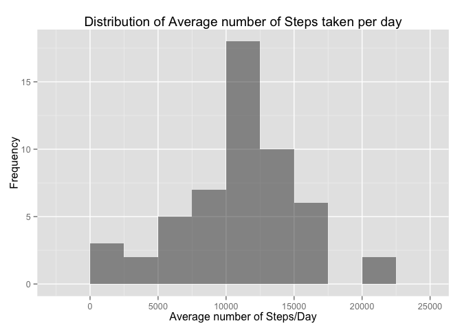
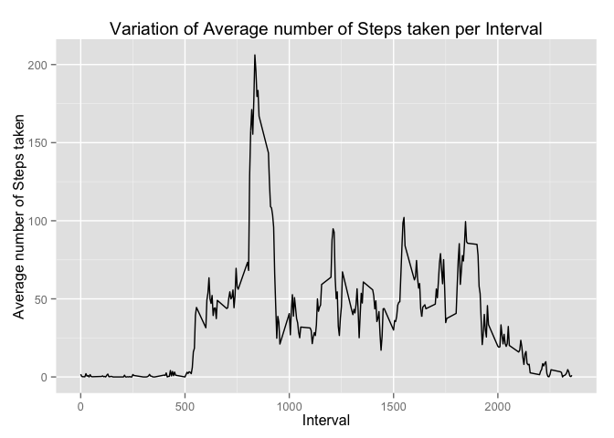
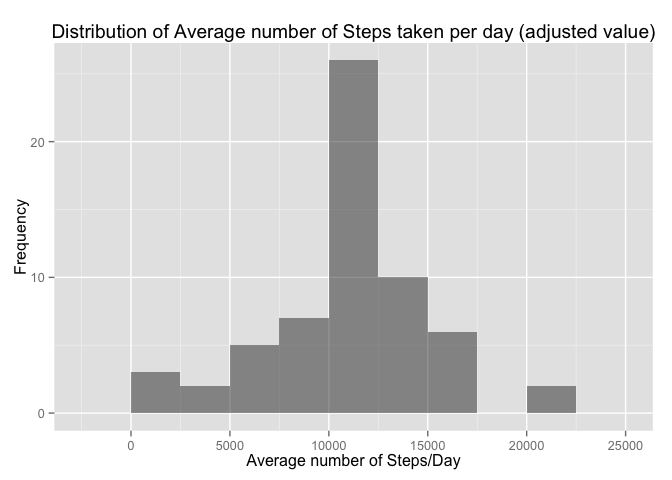
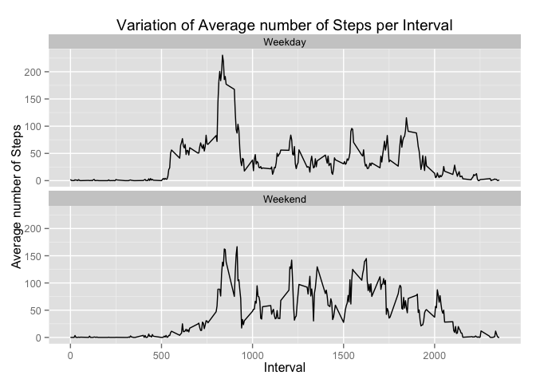

# Reproducible Research: Peer Assessment 1
Sampath Kumar Padmanaban  
March 7, 2015  


## Introduction
This is a R Markdown document produced for the Peer Assessment 1 of Reproducible Research Course (from Coursera). Objective of this assignment is to analyze the data from a personal activity monitoring device.

## Load the data

```r
# URL for the zip file to be downloaded
zipFileURL <- 'https://d396qusza40orc.cloudfront.net/repdata%2Fdata%2Factivity.zip'
# Create a temporary directory for the zip file
zipFileTempDir <- tempdir()
# Create a temporary file to hold the zip file
zipFile <- tempfile(tmpdir=zipFileTempDir, fileext ='.zip')
# Download the zip file from the URL (Note: method = 'curl' is needed only for Mac OS)
download.file(zipFileURL,zipFile,method='curl')
# Get the file name inside the zip file
fileName = unzip(zipFile, list=TRUE)$Name[1]
# unzip the file to the temporary directory
unzip(zipFile, files=fileName, exdir=zipFileTempDir, overwrite=TRUE)
# Get the full path name for the extracted file
zipFilePath = file.path(zipFileTempDir, fileName)
# Read the data file
data.file <- read.csv(zipFilePath, header=TRUE, row.names=NULL, stringsAsFactors=FALSE)
# Unlink the temporary directory
unlink(zipFileTempDir)
```

## Process the data

```r
# Load the library for plotting
library('ggplot2')
# Convert the date values
data.file$date <- as.Date(data.file$date, "%Y-%m-%d")
```

## What is mean total number of steps taken per day?

```r
# Calculate the total number of steps taken per day
totalStepsPerDay <- aggregate(steps ~ date, data.file, sum)
# Make a histogram of the total number of steps taken each day
ggplot(totalStepsPerDay, aes(x=steps)) + 
  geom_histogram(binwidth=2500, alpha=0.5) +
  ggtitle("Distribution of Average number of Steps taken per day") +
  labs(x="Average number of Steps/Day", y="Frequency")
```

 

```r
# Calculate the mean and median of this distribution
totalMean <- mean(totalStepsPerDay$steps)
print(paste('Mean of total number of steps taken per day = ',round(totalMean,digits=2)))
```

```
## [1] "Mean of total number of steps taken per day =  10766.19"
```

```r
totalMedian <- median(totalStepsPerDay$steps)
print(paste('Median of total number of steps taken per day = ',totalMedian))
```

```
## [1] "Median of total number of steps taken per day =  10765"
```

## What is the average daily activity pattern?
1. Make a time series plot (i.e. type = "l") of the 5-minute interval (x-axis) and the average number of steps taken, averaged across all days (y-axis)

```r
# Calculate the average number of steps taken for each time interval
meanStepsPerInterval <- aggregate(steps ~ interval, data.file, mean)
# Plot the average number of steps for each time interval
ggplot(data=meanStepsPerInterval, aes(x=interval, y=steps))+
  geom_line()+
  ggtitle("Variation of Average number of Steps taken per Interval")+
  labs(x="Interval",y="Average number of Steps taken")
```

 

2. Which 5-minute interval, on average across all the days in the dataset, contains the maximum number of steps?

```r
# Get the maximum value of the number of steps taken from all intervals
maxSteps <- max(meanStepsPerInterval$steps)
# Find the interval which has this maximum value
maxStepRowNum <- which.max(meanStepsPerInterval$steps)
maxStepInterval <- meanStepsPerInterval[which.max(meanStepsPerInterval$steps),]$interval
# Report these values
print(paste("Interval with the maximum number of steps is ",maxStepInterval," with ",round(maxSteps,digits=2)," average number of steps"))
```

```
## [1] "Interval with the maximum number of steps is  835  with  206.17  average number of steps"
```

## Imputing missing values
1. Calculate and report the total number of missing values in the dataset (i.e. the total number of rows with NAs)

```r
# Get the row count with missing values
rowsWithMissingValues <- nrow(data.file[complete.cases(data.file),])
# Report this value
print(paste("Total number of rows with missing values in the dataset = ",rowsWithMissingValues))
```

```
## [1] "Total number of rows with missing values in the dataset =  15264"
```

2. Devise a strategy for filling in all of the missing values in the dataset. The strategy does not need to be sophisticated. For example, you could use the mean/median for that day, or the mean for that 5-minute interval, etc.

```r
# Imputing strategy - For any row with a missing value for steps, the average of steps for that interval will be filled. 
# This function takes the interval as the input and returns the average number of steps for that interval calculated across all days
getAverageSteps <- function(interval=0) {
  # Get the row number for this interval from the array which has the averages
  intervalRowNum = which(meanStepsPerInterval$interval == interval)
  # Get the average number of steps for this interval
  avgSteps <- meanStepsPerInterval[intervalRowNum,]$steps
  # Return this value
  return (avgSteps)
}
```

3. Create a new dataset that is equal to the original dataset but with the missing data filled in.

```r
# Add a new column to hold the adjusted value for the steps
data.file$steps.adjusted <- data.file$steps
# Loop through the na rows and fill the values
for(i in 1:nrow(data.file)) {
  if(is.na(data.file[i,]$steps.adjusted)) {
    # Get the interval of this row
    interval <- data.file[i,]$interval
    # populate this value for the missing value
    data.file[i,]$steps.adjusted <- getAverageSteps(interval)
  }
}
```

4. Make a histogram of the total number of steps taken each day and Calculate and report the mean and median total number of steps taken per day. 

```r
totalStepsAdjustedPerDay <- aggregate(steps.adjusted ~ date, data.file, sum)
# Make a histogram of the total number of adjusted steps for each day
ggplot(totalStepsAdjustedPerDay, aes(x=steps.adjusted)) + 
  geom_histogram(binwidth=2500, alpha=0.5) +
  ggtitle("Distribution of Average number of Steps taken per day (adjusted value)") +
  labs(x="Average number of Steps/Day", y="Frequency")
```

 

```r
# Calculate the mean and median of this distribution
totalMeanAdjusted <- mean(totalStepsAdjustedPerDay$steps.adjusted)
print(paste('Mean of total number of steps taken per day (with adjusted values) = ',round(totalMeanAdjusted,digits=2)))
```

```
## [1] "Mean of total number of steps taken per day (with adjusted values) =  10766.19"
```

```r
totalMedianAdjusted <- median(totalStepsAdjustedPerDay$steps.adjusted)
print(paste('Median of total number of steps taken per day (with adjusted values) = ',round(totalMedianAdjusted,digits=2)))
```

```
## [1] "Median of total number of steps taken per day (with adjusted values) =  10766.19"
```

5. Do these values differ from the estimates from the first part of the assignment? What is the impact of imputing missing data on the estimates of the total daily number of steps?

```r
# Report the mean and median values before imputing for NA values
print(paste('Mean of total number of steps taken per day (with NA values) = ',round(totalMean,digits=2)))
```

```
## [1] "Mean of total number of steps taken per day (with NA values) =  10766.19"
```

```r
print(paste('Median of total number of steps taken per day (with NA values) = ',totalMedian))
```

```
## [1] "Median of total number of steps taken per day (with NA values) =  10765"
```

```r
# Report the mean and median values after imputing for NA values
print(paste('Mean of total number of steps taken per day (with adjusted values) = ',round(totalMeanAdjusted,digits=2)))
```

```
## [1] "Mean of total number of steps taken per day (with adjusted values) =  10766.19"
```

```r
print(paste('Median of total number of steps taken per day (with adjusted values) = ',round(totalMedianAdjusted,digits=2)))
```

```
## [1] "Median of total number of steps taken per day (with adjusted values) =  10766.19"
```
Imputing missing data on the total daily steps takes did not have an effect on the mean and median values.


## Are there differences in activity patterns between weekdays and weekends?
1. Create a new factor variable in the dataset with two levels – “weekday” and “weekend” indicating whether a given date is a weekday or weekend day.

```r
# Add a new column for the day of the week
data.file$weekday <- weekdays(data.file$date)
# Create a factor variable for the day level - Weekday or Weekend
data.file$day.type <- ifelse((as.POSIXlt(data.file$date)$wday == 0 | as.POSIXlt(data.file$date)$wday == 6), 'Weekend', 'Weekday')
# Calculate the average number of steps taken per interval for each day type  
# Using the adjusted steps (NA values are adjusted)
meanStepsByDayType <- aggregate(steps.adjusted ~ interval+day.type, data.file, mean)
```

2. Make a panel plot containing a time series plot (i.e. type = "l") of the 5-minute interval (x-axis) and the average number of steps taken, averaged across all weekday days or weekend days (y-axis). 

```r
# Create a plot for the variation by Weekday and Weekend
ggplot(data=meanStepsByDayType)+
  geom_line(aes(x=interval, y=steps.adjusted))+
  facet_wrap(~day.type, nrow=2) + 
  ggtitle("Variation of Average number of Steps per Interval")+
  labs(x="Interval",y="Average number of Steps")
```

 

End of Work

